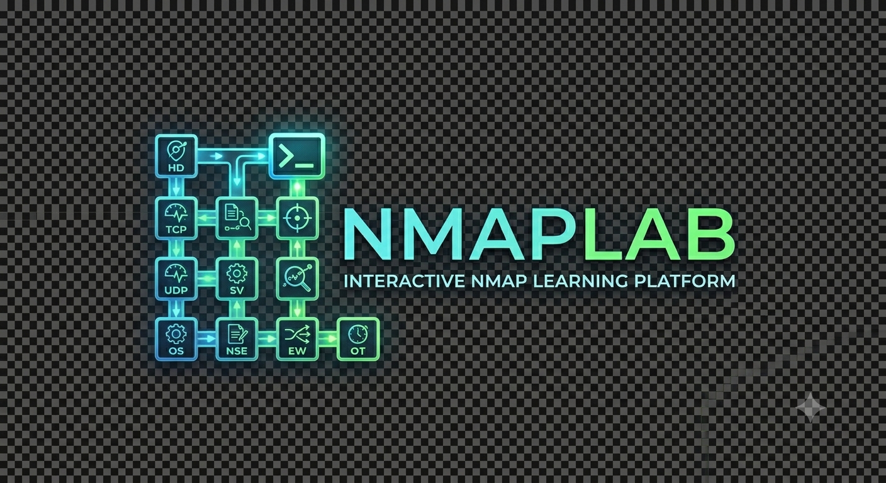
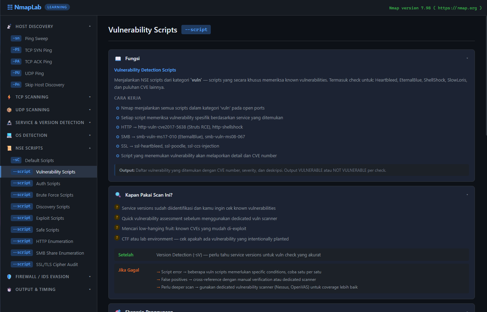

<p align="center">
  
</p>

<p align="center">
  
  
  
</p>

Interactive web-based tool for learning Nmap scanning techniques. Each scan type comes with detailed documentation (fungsi, skenario, MITRE ATT&CK mapping, precautions, impact) and a built-in console to run scans directly from the browser.



## Features

- **30+ scan types** organized in 8 categories
- **6 info sections** per scan: Fungsi, Kapan Pakai, Skenario, MITRE ATT&CK, Precautions, Impact
- **Try It console** — run Nmap commands directly and see output in-browser
- **Smart options** — only shows compatible flags per scan type
- **Command builder** — pick options, enter target, click Run
- **Dark theme** terminal-style UI

## Scan Categories

| Category | Scans |
|---|---|
| Host Discovery | Ping Sweep, TCP SYN Ping, TCP ACK Ping, UDP Ping, Skip Discovery |
| TCP Scanning | SYN, Connect, ACK, FIN, Xmas, Null, Window |
| UDP Scanning | UDP Scan |
| Service & Version Detection | Version Detection, Aggressive Scan |
| OS Detection | OS Detection |
| NSE Scripts | Default, Vuln, Auth, Brute, Discovery, Exploit, Safe, HTTP Enum, SMB Enum, SSL Cipher Audit |
| Firewall / IDS Evasion | Fragment Packets, Decoy Scan, Source Port Spoof |
| Output & Timing | Timing Templates, Normal Output, XML Output |

## Prerequisites

### 1. Python 3.10+

Download from [python.org](https://www.python.org/downloads/) or install via package manager:

```bash
# Windows (winget)
winget install Python.Python.3.12

# macOS
brew install python

# Linux (Debian/Ubuntu)
sudo apt install python3 python3-pip
```

### 2. Nmap

Nmap must be installed and available in PATH.

```bash
# Windows
# Download installer from https://nmap.org/download.html
# Or via winget:
winget install Insecure.Nmap

# macOS
brew install nmap

# Linux (Debian/Ubuntu)
sudo apt install nmap

# Linux (RHEL/Fedora)
sudo dnf install nmap
```

Verify installation:

```bash
nmap --version
```

### 3. Flask

```bash
pip install -r requirements.txt
```

## Quick Start

```bash
# 1. Clone the repo
git clone https://github.com/marcos-liao/nmap-lab.git
cd nmap-lab

# 2. Install dependencies
pip install -r requirements.txt

# 3. Run the server
python server.py

# 4. Open browser
# http://127.0.0.1:5000
```

## Usage

1. Select a scan type from the sidebar
2. Read the documentation sections (Fungsi, Kapan Pakai, Skenario, etc.)
3. Scroll down to **Try It**
4. Enter a target IP/hostname/CIDR
5. Toggle options (verbose, timing, ports, etc.)
6. Click **Run Scan**
7. View results in the embedded console

## Important Notes

- **Authorization required** — Never scan targets without explicit written permission
- **Root/admin privileges** — Some scan types (SYN, FIN, Xmas, Null, OS detection) require elevated privileges
- **Learning purposes** — This tool is designed for cybersecurity education and authorized penetration testing
- **Safe targets for practice:**
  - `scanme.nmap.org` — Nmap's official test target
  - Your own local network devices
  - Lab VMs (TryHackMe, Hack The Box, VulnHub)

## Project Structure

```
nmap-lab/
├── server.py           # Flask backend — executes Nmap, serves API
├── index.html          # Main page
├── css/
│   └── style.css       # Dark theme styling
├── js/
│   ├── scans.js        # Scan definitions & documentation data
│   └── app.js          # Frontend logic (sidebar, rendering, console)
├── requirements.txt    # Python dependencies
└── .gitignore
```

## Running on Linux

Most Nmap scan types require root privileges. On Linux, run the server with `sudo` or use a user with appropriate capabilities:

```bash
# Option 1: Run server as root
sudo python server.py

# Option 2: Give Nmap capabilities (no sudo needed after this)
sudo setcap cap_net_raw,cap_net_admin+eip $(which nmap)
python server.py
```

**Firewall note:** If you have `ufw` or `iptables` active, make sure port 5000 is allowed for local access:

```bash
# ufw
sudo ufw allow 5000/tcp

# Or access via localhost only (no firewall change needed)
# Default: server binds to 127.0.0.1
```

**SELinux:** On RHEL/Fedora with SELinux enforcing, you may need to allow Python to bind to port 5000:

```bash
sudo setsebool -P httpd_can_network_connect 1
```

## Nmap Version Compatibility

NmapLab has been tested with Nmap 7.x. Some features depend on specific Nmap versions:

| Feature | Minimum Nmap Version | Notes |
|---|---|---|
| Basic scans (-sS, -sT, -sU) | 4.x+ | Core functionality, works on all versions |
| NSE scripts (-sC, --script) | 5.0+ | NSE engine introduced in Nmap 5 |
| SSL cipher enumeration | 6.x+ | ssl-enum-ciphers script |
| HTTP enumeration | 6.x+ | http-enum script with extended fingerprints |
| SMB vulnerability checks | 7.x+ | smb-vuln-ms17-010 and newer scripts |
| TLS 1.3 detection | 7.80+ | TLS 1.3 cipher suite support |

Check your installed version:

```bash
nmap --version
```

Update to latest:

```bash
# Windows — download from https://nmap.org/download.html
# macOS
brew upgrade nmap
# Debian/Ubuntu
sudo apt update && sudo apt install nmap
# RHEL/Fedora
sudo dnf upgrade nmap
```

Older versions will still work for most scan types — NmapLab gracefully shows whatever output Nmap returns.

## Adding New Scan Types

Edit `js/scans.js` and add a new entry to the appropriate category in `SCAN_CATEGORIES`:

```javascript
{
  id: "my-scan",
  name: "My Custom Scan",
  flag: "-sX",
  flags: ["-sX", "--some-flag"],    // actual flags sent to backend
  command: "nmap -sX --some-flag",  // displayed in command bar
  optionsConfig: { noPing: false }, // hide incompatible options
  fungsi: { ... },
  kapanPakai: { ... },
  skenario: [ ... ],
  mitre: { ... },
  precautions: [ ... ],
  impact: { ... }
}
```

If the new scan uses flags not yet whitelisted, add them to `ALLOWED_FLAGS` in `server.py`.

## Security

- Backend validates all input — target and flags are whitelisted
- Only pre-approved Nmap flags are allowed (no arbitrary command injection)
- Scan timeout: 120 seconds max
- No shell execution — uses `subprocess` with argument list

## Contributors

- **Marcos** — [@marcos-liao](https://github.com/marcos-liao)

## License

MIT
